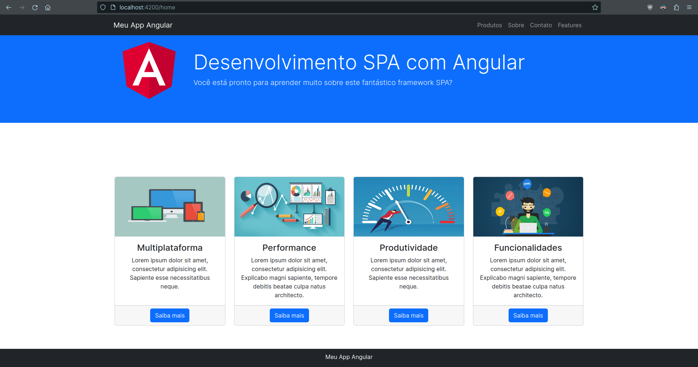
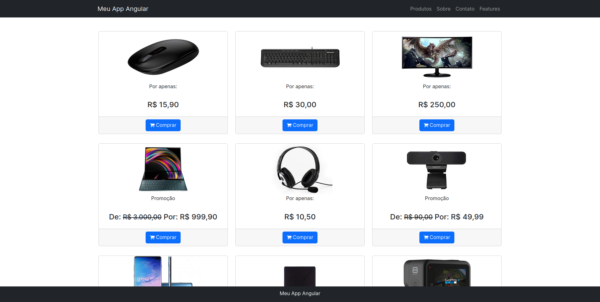
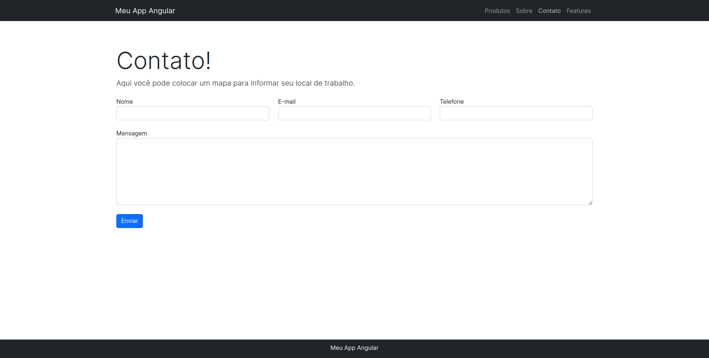
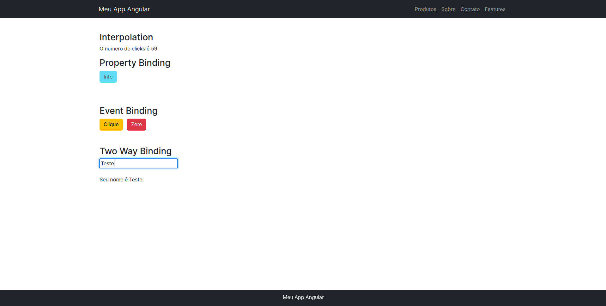

<h1 align="center">
    
    <b>Product Listing</b>
</h1>

## <p>📚 About </p>
A SPA (Single Page Application) that lists products and other actions using the basic resources of the Angular framework.

## <p>📝 Used Features of Angular </p> 
- **Angular CLI**
- **Components**
- **Modules**
- **Services**
- **Data Binding**
- **Pipes**
- **Directives**
- **Routing**
- **Dependence Injection**

## <p>🚀 Technologies Used</p>
This project was built with the following technologies:

-  [Angular](https://angular.io/)
-  [Bootstrap](https://getbootstrap.com/) v5.2.3
-  [Font Awesome](https://icons.getbootstrap.com/) v4.7.0

## <p>🛠️ How to Use Locally </p>
To clone and run this app, from the command line:

```bash
# Clone this repo
$ git clone https://github.com/lucasferreiraz/angular-spa-demo.git

# Enter the folder
$ cd angular-spa-demo

# Install dependencies
$ npm install

# Start application
$ npm start
```

To run the fake product API:
```bash
# Install dependencie
$ npm install -g json-server

# Enter the folder
$ cd angular-spa-demo

# Run the server
$ json-server products.json
```

## <p>🎲 Fake Backend </p>

-  [json-server](https://www.npmjs.com/package/json-server)
- Using [this json file](./products.json)

## <p>🔧 Update Versions </p>

-  [npm-check-updates](https://www.npmjs.com/package/npm-check-updates)

## <p>📷 Demonstration </p>

### Home


### Products


### Contact


### Features


---

<p align="center" style="font-weight:bolder">
    Developed with 💛 by <a href="https://github.com/lucasferreiraz">Lucas Ferreira</a>
</p>